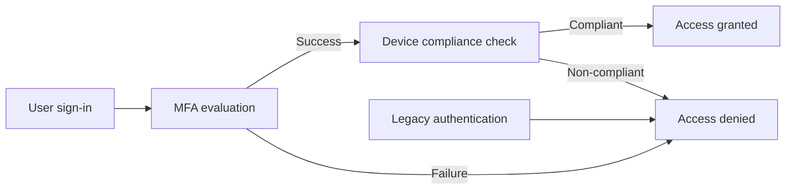

# Conditional Access

## Overview
This section documents the Conditional Access (CA) baseline implemented
in Microsoft Entra ID to enforce Zero Trust access controls for
corporate cloud resources.

The policies are designed to:
- Reduce credential-based attack surface
- Enforce strong user authentication
- Ensure access is granted only from compliant devices
- Maintain recoverability through a dedicated break-glass account

All controls are validated using policy configuration evidence
and sign-in evaluation results.

---

## Design Principles
The Conditional Access design follows these principles:

- **Zero Trust:** Access is continuously evaluated based on user,
  device, and authentication context
- **Layered controls:** MFA, device compliance, and protocol restrictions
  are enforced independently
- **Least privilege & recoverability:** Emergency access is preserved
  through explicit break-glass exclusions
- **Auditability:** Enforcement is demonstrated through sign-in logs

---

## Targeting Model
Conditional Access policies are evaluated at **user sign-in** and
are therefore scoped at the user level.

Targeting approach:
- **Included:** All users
- **Excluded:** Break-glass account
- **Resources:** All cloud apps

This model provides consistent coverage while preventing
administrative lockout scenarios.

---

## Conditional Access Flow

---

## Rollout Strategy

Conditional Access policies are rolled out using a staged approach
to minimize the risk of service disruption and administrative lockout.

### Rollout phases
1. **Report-only**
   - Policies are initially evaluated in report-only mode
   - Sign-in logs are reviewed to identify potential impact

2. **Pilot enforcement**
   - Policies are enforced for a limited pilot scope
   - Authentication and access behavior is validated using sign-in logs

3. **Full enforcement**
   - Policies are enabled tenant-wide
   - Break-glass account remains excluded to ensure recoverability

This approach allows safe validation of Conditional Access behavior
before broad enforcement.

---

## Implemented Policies

### CA – Require MFA
Enforces multi-factor authentication for all user sign-ins to
cloud applications.

- Control type: Authentication
- Enforcement: Grant access only after MFA challenge
- Evidence: Policy configuration and sign-in logs

---

### CA – Require Compliant Device
Restricts access to cloud resources to devices that meet
Microsoft Intune compliance requirements.

- Control type: Device posture
- Enforcement: Require device to be marked as compliant
- Evidence: Policy configuration, user-facing denial, and sign-in logs

---

### CA – Block Legacy Authentication
Blocks legacy authentication protocols that do not support
modern security controls.

- Control type: Protocol restriction
- Enforcement: Block access for legacy authentication clients
- Evidence: Policy configuration and client app conditions

---

### Break-glass Account
A dedicated emergency administrative account used exclusively
for recovery scenarios.

- Excluded from all Conditional Access policies
- Assigned Global Administrator role
- Not used for daily administration
- Evidence: User creation and role assignment

---

## Operational Considerations
- Conditional Access policies are enabled in enforcement mode
  unless explicitly documented otherwise
- Changes to CA policies should be validated using sign-in logs
  before broad rollout
- Break-glass account access should be audited after each use

---

## Scope Boundary
This section focuses exclusively on **identity-based access controls**.

It does not cover:
- Intune compliance policy definitions
- Endpoint configuration profiles
- Application deployment or protection policies

Those controls are documented in their respective sections
of the repository.

---

## Summary
This Conditional Access baseline provides a layered, auditable,
and recoverable identity security posture aligned with
enterprise Zero Trust principles.
